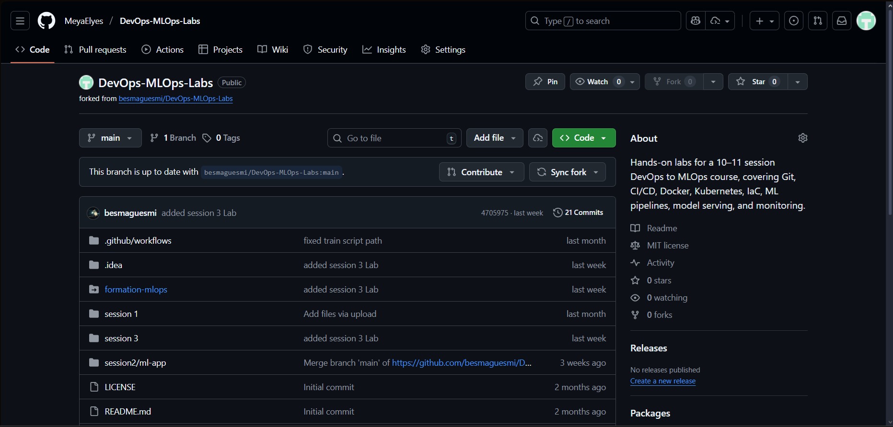
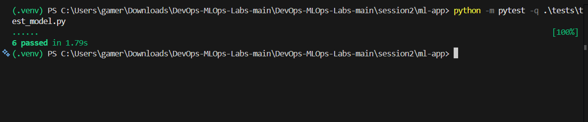
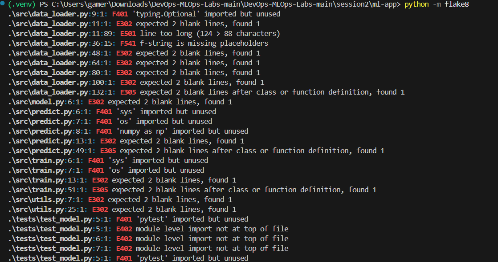
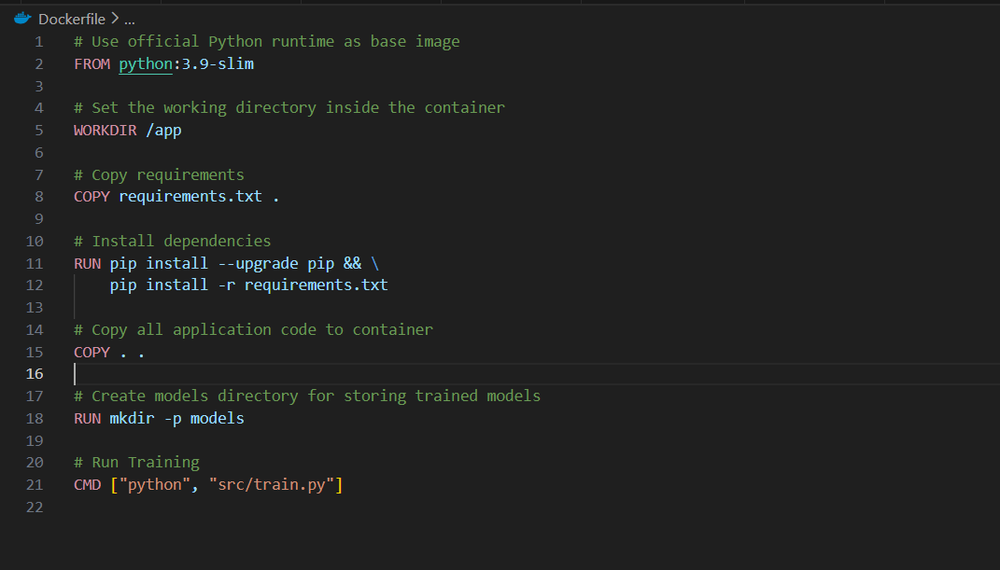

# DevOps/MLOps Lab Report


---

## Task 1: Prepare the ML Project

**What I did:**
- Downloaded the project ZIP file
- Created a new GitHub repository
- Verified `requirements.txt` exists

**Screenshot:**



---

## Task 2: Run the App Locally

**Commands I ran:**

```bash
# Create virtual environment
python -m venv .venv

# Activate it (Windows)
.venv\Scripts\Activate.ps1

# Install dependencies
pip install -r requirements.txt

# Train the model
python src/train.py

# Test predictions
python src/predict.py
```

**What happened:**
- Model trained successfully 
- Saved model to `models/iris_classifier.pkl`

**Screenshots:**


---

## Task 3: Write Unit Tests

**What I did:**
- Ran the tests 


**Command to run tests:**
```bash
python -m pytest -q 
```

**Result:** All 6 tests passed ✅

**Screenshot:**



---

## Task 4: Linting & Formatting

**What I did:**
- Created `.flake8` configuration file
- Set max line length to 88 characters
- Excluded `.venv`, `__pycache__`, etc.

**Command to run linter:**
```bash
python -m flake8
```


**Screenshot:**



---

## Task 5: GitHub Actions CI Workflow

**What I did:**
- Created `.github/workflows/ci.yml`
- CI runs on push to `main` and pull requests
- Pipeline steps:
  1. Checkout code
  2. Setup Python 3.13.1
  3. Install dependencies
  4. Run flake8
  5. Run pytest
  6. Build Docker image
  7. Upload artifacts

## Task 6: Containerize the App

**What I did:**
- Created `Dockerfile` with Python 3.9-slim base image
- Copies app code and installs dependencies
- Default command runs training

**Commands I ran:**
```bash
# Build image
docker build -t my-ml-app:latest .

# Run training in container
docker run my-ml-app:latest
```

**Screenshot:**



---


## Summary

✅ All tests passing  
✅ Code passes linting  
✅ Docker image builds successfully  
✅ CI/CD pipeline working  

**Repo Link:** [https://github.com/MeyaElyes/DevOps-MLOps-Labs]
